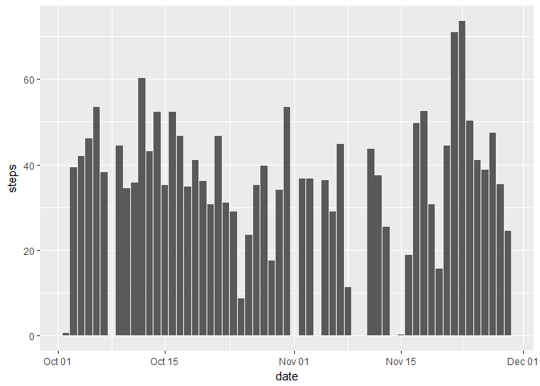

# Reproducible Research: Peer Assessment 1


```r
library(dplyr)
```

```
## 
## Attaching package: 'dplyr'
```

```
## The following objects are masked from 'package:stats':
## 
##     filter, lag
```

```
## The following objects are masked from 'package:base':
## 
##     intersect, setdiff, setequal, union
```

```r
library(tidyr)
library(ggplot2)
library(scales)
library(knitr)
library(gridExtra)
```

```
## 
## Attaching package: 'gridExtra'
```

```
## The following object is masked from 'package:dplyr':
## 
##     combine
```

## R Markdown

This is an R Markdown document. Markdown is a simple formatting syntax for authoring HTML, PDF, and MS Word documents. For more details on using R Markdown see <http://rmarkdown.rstudio.com>.

When you click the **Knit** button a document will be generated that includes both content as well as the output of any embedded R code chunks within the document. You can embed an R code chunk like this:


```r
originalData <- read.table("./activity.csv", sep = ",", header = TRUE)

activityCSV <- originalData[!is.na(originalData$steps),]

activityCSV$steps <- as.numeric(as.character(activityCSV$steps))
activityCSV$date <- as.Date(as.character(activityCSV$date))
activityCSV$interval <- as.numeric(as.character(activityCSV$interval))
activityCSV$dateNum <- as.numeric(activityCSV$date)
```

## Histogram:  Calculate the total number of steps taken per day ##


```r
# steps per day
groupedSteps <- aggregate(steps~date, FUN=mean, data=activityCSV)

g<-ggplot(data=groupedSteps,aes(x=date,y=steps)) + geom_bar(stat="identity")

g
```

<!-- -->

## Calculate and report the mean and median of the total number of steps taken per day ##

### Mean ###


```r
mean(activityCSV$steps)
```

```
## [1] 37.3826
```

### Median ###


```r
median(activityCSV$steps)
```

```
## [1] 0
```

## 5-minute interval (x-axis) and the average number of steps taken, averaged across all days (y-axis) ##


```r
aggregatedData <- aggregate(x = activityCSV,by = list(activityCSV$interval), FUN=mean)

ggplot(data=aggregatedData, aes(x=interval, y=steps)) + geom_line()
```

<!-- -->

## maximum number of steps ##


```r
orderedData <- aggregatedData[ order(-aggregatedData[,2]), ]
  
head(orderedData,n=1)
```

```
##     Group.1    steps       date interval  dateNum
## 104     835 206.1698 2012-10-30      835 15643.72
```

# Imputing missing values #

## Total Missing Values in Data Set ##


```r
originalNA <- originalData[is.na(originalData$steps),]

count(originalNA)
```

```
## # A tibble: 1 × 1
##       n
##   <int>
## 1  2304
```

## replace values with 0 ##

Assumes that NA results in 0 due to the fact that we have no reference for assuming what the NA value is.


```r
originalData <- read.table("./activity.csv", sep = ",", header = TRUE)

originalData$steps[is.na(originalData$steps)] <- 0

activityCSV <- originalData[!is.na(originalData$steps),]

activityCSV$steps <- as.numeric(as.character(activityCSV$steps))
activityCSV$date <- as.Date(as.character(activityCSV$date))

activityCSV$interval <- as.numeric(as.character(activityCSV$interval))

activityCSV$dateNum <- as.numeric(activityCSV$date)
groupedSteps <- aggregate(steps~date, FUN=mean, data=activityCSV)

g<-ggplot(data=groupedSteps,aes(x=date,y=steps)) + geom_bar(stat="identity")

g
```

<!-- -->

### Mean ###


```r
mean(activityCSV$steps)
```

```
## [1] 32.47996
```

### Median ###


```r
median(activityCSV$steps)
```

```
## [1] 0
```

### weekends vs weekdays ###


```r
activityCSV$weekday<-weekdays(activityCSV$date)
  
activityCSV1 = subset(activityCSV,activityCSV$weekday == "Saturday" | activityCSV$weekday == "Sunday")
activityCSV2 = subset(activityCSV,activityCSV$weekday != "Saturday" & activityCSV$weekday != "Sunday")
  
plot1 <- ggplot(data=activityCSV1, aes(x=interval, y=steps)) + geom_line() + ggtitle("Weekends")
plot2 <- ggplot(data=activityCSV2, aes(x=interval, y=steps)) + geom_line() + ggtitle("Weekdays")
grid.arrange(plot1, plot2, ncol=1)
```

<!-- -->
